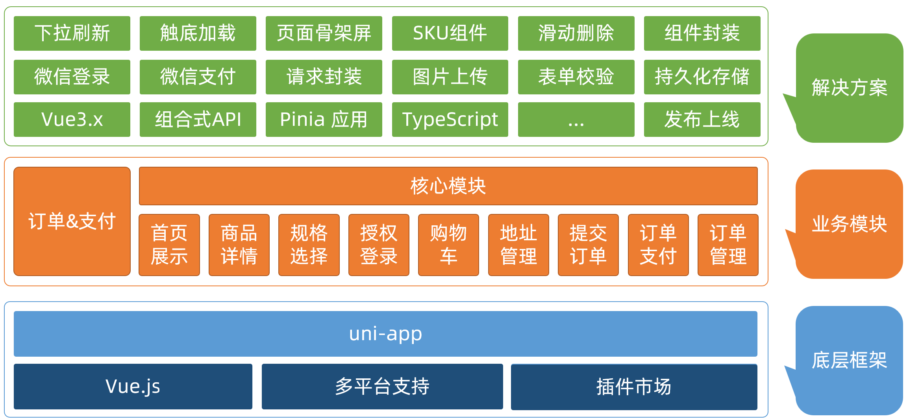
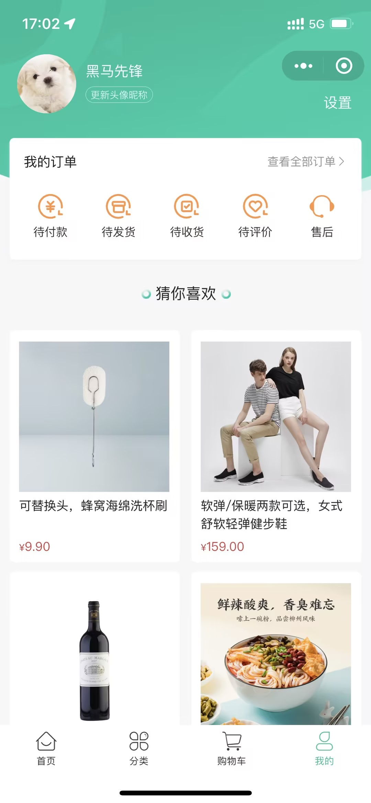
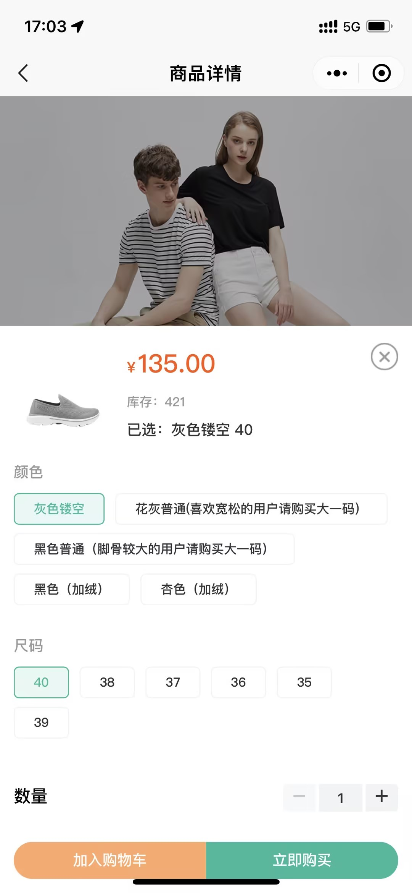
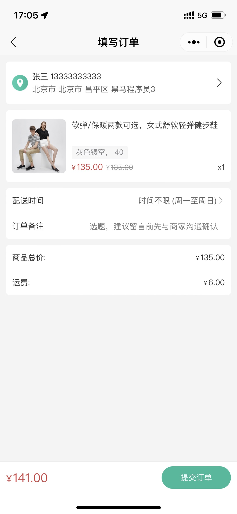
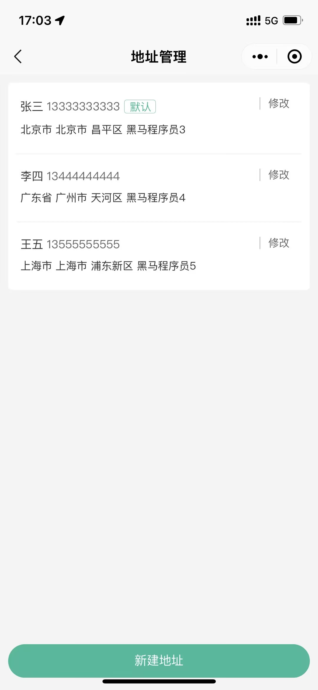
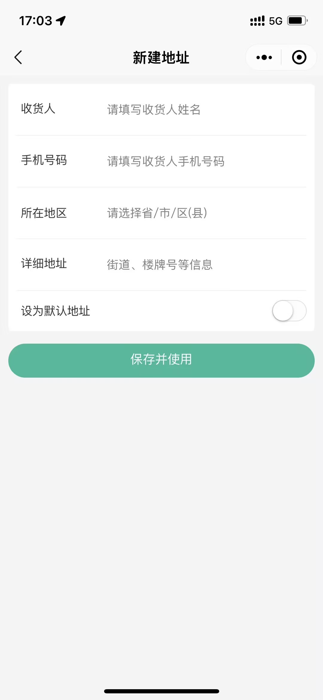
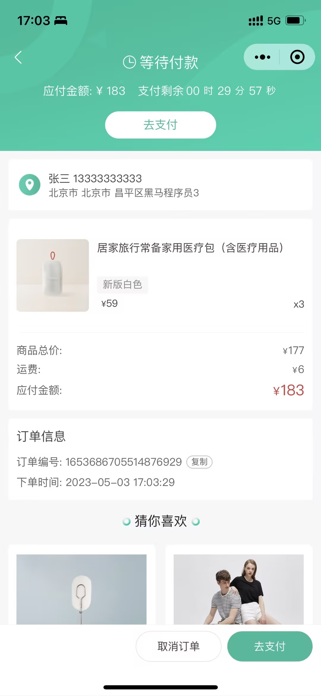
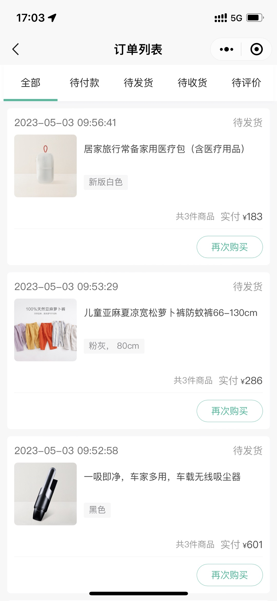
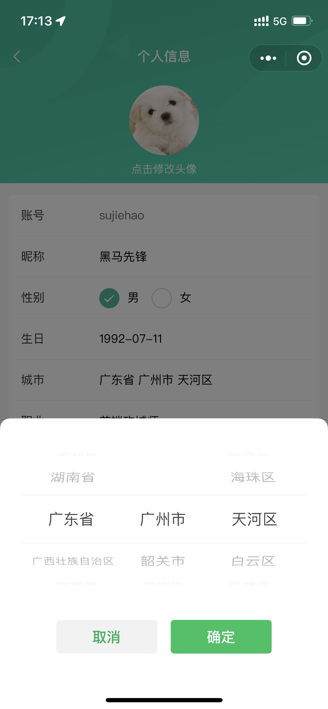

## 项目简介

### 项目说明

小兔鲜儿体系包含五个端：微信小程序端，H5 端，App 端，PC 端，管理后台。

当前仓库是 **uni-app** 开发的**微信小程序端**，通过**条件编译**能兼容 **H5 端** 和 **App 端**。

### 在线体验

<table>
  <tr>
    <td>体验小程序端</td>
    <td><a target="_blank" href="https://megasu.gitee.io/uniapp-shop-vue3-ts/">体验 H5 端</a></td>
    <td><a target="_blank" href="https://gitee.com/Megasu/uniapp-shop-vue3-ts/releases/download/v1.0.0/heima-shop.apk">体验 App 端(安卓)</a></td>
  </tr>
  <tr>
    <td></td>
    <td></td>
    <td></td>
  </tr>
</table>

## 资料说明

### 📀 视频学习

[https://www.bilibili.com/video/BV1Bp4y1379L/](https://www.bilibili.com/video/BV1Bp4y1379L/?share_source=copy_web&vd_source=2ac50d29193927b3c8597537dc4bc81d)

### 📗 接口文档

[https://www.apifox.cn/apidoc/shared-0e6ee326-d646-41bd-9214-29dbf47648fa/](https://www.apifox.cn/apidoc/shared-0e6ee326-d646-41bd-9214-29dbf47648fa/)

### ✏️ 在线笔记

[https://megasu.gitee.io/uni-app-shop-note/](https://megasu.gitee.io/uni-app-shop-note/)

### 📦 项目源码

[https://gitee.com/Megasu/uniapp-shop-vue3-ts/](https://gitee.com/Megasu/uniapp-shop-vue3-ts/)

### 项目架构



## 项目演示

### 在线演示

项目已上线，微信搜索小程序 **小兔鲜儿** 即可体验。

### 项目截图

<table>
  <tr>
    <td></td>
    <td></td>
    <td></td>
    <td></td>
    <td></td>
    <td></td>
  </tr>
  <tr>
    <td></td>
    <td></td>
    <td></td>
    <td></td>
    <td></td>
    <td></td>
  </tr>
</table>

## 小兔鲜儿-微信小程序

### 项目简介

微信小程序端：该项目包含了从首页浏览商品，到商品详情，微信登录，加入购物车，提交订单，微信支付，订单管理等功能。

### 技术栈

- 前端框架：[uni-app](https://uniapp.dcloud.net.cn/) (Vue3 + TS)
- 状态管理：[pinia](https://pinia.vuejs.org/zh/)
- 组件库：[uni-ui](https://uniapp.dcloud.net.cn/component/uniui/uni-ui.html)

### 项目模块

- 项目起步
- 首页模块
- 推荐模块
- 分类模块
- 详情模块
- 登录模块
- 用户模块
- 地址模块
- SKU 模块
- 购物车模块
- 订单模块
- 项目打包

### 开发环境

- Windows 版本： Windows 11 家庭中文版
- 开发工具： VS Code 、 HbuilderX 、 微信开发者工具
- Node 版本： v16.15.0
- pnpm 版本：v8.6.10

### 运行程序

1. 安装依赖

```shell
# npm
npm i --registry=https://registry.npmmirror.com

# pnpm
pnpm i --registry=https://registry.npmmirror.com
```

2. 运行程序

```shell
# 微信小程序端
npm run dev:mp-weixin

# H5端
npm run dev:h5

# App端
需 HbuilderX 工具，运行 - 运行到手机或模拟器
```

3. 微信开发者工具导入 `/dist/dev/mp-weixin` 目录

### 工程结构解析

```
├── .husky                     # Git Hooks
├── .vscode                    # VS Code 插件 + 设置
├── dist                       # 打包文件夹（可删除重新打包）
├── src                        # 源代码
│   ├── components             # 全局组件
│   ├── composables            # 组合式函数
│   ├── pages                  # 主包页面
│       ├── index               # 首页
│       ├── category            # 分类页
│       ├── cart                # 购物车
│       ├── my                  # 我的
│       ├── goods               # 商品详情
│       └── hot                 # 热门推荐
│       └── login               # 登录页
│   ├── pagesMember            # 分包页面(用户模块)
│       ├── address             # 地址管理
│       ├── address-form        # 地址表单
│       ├── profile             # 用户信息
│       └── settings            # 用户设置
│   ├── pagesOrder             # 分包页面(订单模块)
│       ├── create              # 创建订单
│       ├── detail              # 订单详情
│       ├── list                # 订单列表
│       └── payment             # 支付结果
│   ├── services               # 所有请求
│   ├── static                 # 存放应用引用的本地静态资源的目录
│       ├── images              # 普通图片
│       └── tabs                # tabBar 图片
│   ├── stores                 # 全局 pinia store
│       ├── modules             # 模块
│       └── index.ts            # store 入口
│   ├── styles                 # 全局样式
│       └── fonts.scss          # 字体图标
│   ├── types                  # 类型声明文件
│   ├── utils                  # 全局方法
│   ├── App.vue                # 入口页面
│   ├── main.ts                # Vue初始化入口文件
│   ├── pages.json             # 配置页面路由等页面类信息
│   ├── manifest.json          # 配置appid等打包信息
│   └── uni.scss               # uni-app 内置的常用样式变量
├── .eslintrc.cjs              # eslint 配置
├── .prettierrc.json           # prettier 配置
├── .gitignore                 # git 忽略文件
├── index.html                 # H5 端首页
├── package.json               # package.json 依赖
├── tsconfig.json              # typescript 配置
└── vite.config.ts             # vite 配置
```
